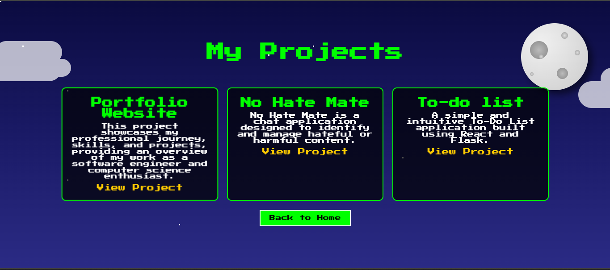

# Portfolio

Welcome to my portfolio repository! This project showcases my professional journey, skills, and projects, providing an overview of my work as a software engineer and computer science enthusiast.

## Table of Contents

- [About the Project](#about-the-project)
- [Screenshots](#screenshots)
- [Technologies Used](#technologies-used)
- [Features](#features)
- [Contact](#contact)

---

## About the Project

This portfolio is a personal website designed to highlight my skills, showcase my projects, and share my professional journey. It serves as a dynamic resume and a platform to connect with potential collaborators, employers, and like-minded individuals.

---

## Screenshots

### Home Page

### About Me

### Projects

### Resume

---

## Technologies Used

The project is built using:

- **HTML**: For structure and layout.
- **CSS**: For styling and design.
- **JavaScript**: For interactive features and dynamic content.

---

## Features

- Professional introduction and about me section.
- Showcase of projects with descriptions and links to live demos or GitHub repositories.
- Contact section with social links.
- Responsive design for seamless viewing across devices.

---

## Contact
Feel free to connect with me:

- Email: yashpandharish@vt.edu
- GitHub: yash-kulkarni2000
- LinkedIn: https://www.linkedin.com/in/yash-kulkarni-657b971b9/

- Thank you for visiting my portfolio repository! If you have any suggestions or feedback, feel free to open an issue or reach out to me.